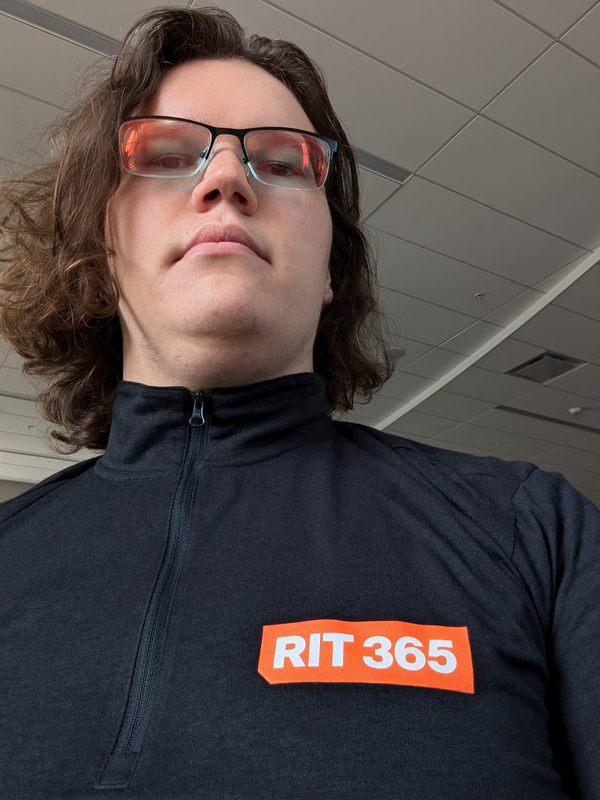

---
# Feel free to add content and custom Front Matter to this file.
# To modify the layout, see https://jekyllrb.com/docs/themes/#overriding-theme-defaults

layout: home
title: "evan/"
---
# Evan Savage
<figure></figure>
## Howdy Hey!

I'm some sort of software engineer.

I'm a student at RIT, simultaneously pursuing a Bachelors and Masters in Software Engineering in my second year.

I'm looking for a full-time paid internship or co-op between May 2025 and August 2026 (That's 15 months).

I'm pretty good at **Python** and **Java**;
Plenty adequate in **C**, and **Javascript**;
Learning **Mathematica**, **Matlab**, and **Rust**;
Want to Learn ~~**OCaml, COBOL, GLSL, Haskell, Kotlin**~~ everything.

Want to Contact Me or Checkout my Resumé?
<a href="mailto:contact@evansavage.me">contact@evansavage.me</a>
<a href="https://linkedin.com/in/evan-savage">LinkedIn</a>
<a href="https://github.com/evansnavage">GitHub</a>
<a href="/resume/">Resumé</a>
